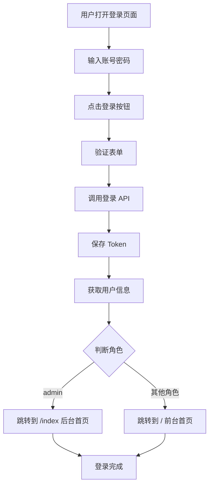

# 登录跳转规则说明

## 🎯 需求说明

根据不同用户角色，登录成功后跳转到不同的首页：

1. **admin（超级管理员）** → 后台管理首页（`/index`）
2. **其他用户（顾客、普通员工）** → 前台购物首页（`/`）

---

## ✅ 实现方案

### 修改文件
**文件**：`eduswap-ui/src/views/login.vue`

### 修改内容

#### 修改前：
```javascript
this.$store.dispatch("Login", this.loginForm).then(() => {
  this.$router.push({ path: this.redirect || "/" }).catch(()=>{})
}).catch(() => {
  // ...
})
```

#### 修改后：
```javascript
this.$store.dispatch("Login", this.loginForm).then(() => {
  // 获取用户角色信息
  const roles = this.$store.getters.roles
  // 根据角色决定跳转页面
  if (roles && roles.includes('admin')) {
    // 管理员跳转到后台首页
    this.$router.push({ path: this.redirect || '/index' }).catch(()=>{})
  } else {
    // 其他用户（顾客、普通员工）跳转到前台购物首页
    this.$router.push({ path: this.redirect || '/' }).catch(()=>{})
  }
}).catch(() => {
  // ...
})
```

---

## 📋 跳转规则详解

### 规则 1：管理员（admin）

**判断条件**：
```javascript
roles.includes('admin')
```

**跳转目标**：
- 路径：`/index`
- 组件：`@/views/index`（后台 dashboard）
- 特点：带侧边栏、数据统计图表

**访问示例**：
```
http://localhost:1024/index
```

### 规则 2：其他用户（顾客 customer、普通员工 common）

**判断条件**：
```javascript
!roles.includes('admin')
```

**跳转目标**：
- 路径：`/`
- 组件：`@/views/front/Home`（前台购物首页）
- 特点：商品列表、购物界面

**访问示例**：
```
http://localhost:1024/
```

---

## 🔄 完整登录流程



---

## 🎨 实际效果

### 场景 1：admin 登录

1. 访问：`http://localhost:1024/`
2. 自动重定向到：`http://localhost:1024/login`
3. 输入账号：`admin`，密码：`admin123`
4. 登录成功后跳转到：`http://localhost:1024/index`（后台 dashboard）

### 场景 2：顾客登录

1. 访问：`http://localhost:1024/`
2. 自动重定向到：`http://localhost:1024/login`
3. 输入账号：`王小二`，密码：`123456`
4. 登录成功后跳转到：`http://localhost:1024/`（前台购物首页）

### 场景 3：指定跳转

1. 访问：`http://localhost:1024/publish`（发布商品）
2. 自动重定向到：`http://localhost:1024/login?redirect=%2Fpublish`
3. 登录成功后跳转到：`http://localhost:1024/publish`（原目标页面）

---

## ⚠️ 注意事项

### 1. 角色判断顺序

```javascript
// 先判断是否是 admin
if (roles && roles.includes('admin')) {
  // admin 逻辑
} else {
  // 其他用户逻辑
}
```

### 2. redirect 参数优先级

- 如果有 `redirect` 参数，优先跳转到指定页面
- 如果没有 `redirect` 参数，根据角色跳转到默认首页

### 3. 角色名称必须准确

- 管理员角色：`admin`（来自 `sys_role.role_key`）
- 顾客角色：`customer`
- 普通员工：`common`

---

## 🔧 测试步骤

### 测试 1：admin 登录

1. 退出当前账号
2. 访问：`http://localhost:1024/`
3. 使用 admin 账号登录
4. **预期结果**：跳转到后台 dashboard（`/index`）

### 测试 2：顾客登录

1. 退出当前账号
2. 访问：`http://localhost:1024/`
3. 使用顾客账号登录（王小二 / 123456）
4. **预期结果**：跳转到前台购物首页（`/`）

### 测试 3：带 redirect 参数

1. 访问：`http://localhost:1024/publish`
2. 自动跳转到登录页，URL 包含 `?redirect=%2Fpublish`
3. 使用任意账号登录
4. **预期结果**：跳转到 `/publish` 页面

---

## 📝 相关代码位置

### 1. 登录页面
```
eduswap-ui/src/views/login.vue
```

### 2. 路由配置
```
eduswap-ui/src/router/index.js
```

### 3. Vuex Store
```
eduswap-ui/src/store/modules/user.js
```

### 4. 权限验证
```
eduswap-ui/src/permission.js
```

---

## 🎯 优化建议

### 当前实现 ✅
- 根据角色判断跳转
- 支持 redirect 参数
- 代码简洁清晰

### 未来优化 ⚠️
1. **顾客角色限制**
   - 顾客登录后不能访问后台
   - 在 `permission.js` 中添加路由守卫

2. **Token 过期处理**
   - Token 过期后重新登录
   - 保持原跳转路径

3. **多端适配**
   - 移动端跳转到移动端首页
   - PC 端跳转到 PC 端首页

---

## 📊 角色跳转对照表

| 角色 | role_key | 登录后跳转 | 跳转路径 | 页面类型 |
|------|----------|-----------|---------|---------|
| 超级管理员 | admin | 后台首页 | `/index` | Dashboard |
| 普通员工 | common | 前台首页 | `/` | 购物首页 |
| 顾客 | customer | 前台首页 | `/` | 购物首页 |

---

**修改日期**：2026-03-11  
**修改内容**：登录跳转逻辑优化  
**适用版本**：EduSwap v1.0
