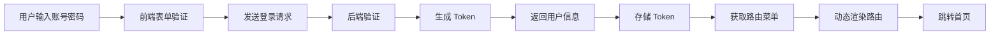
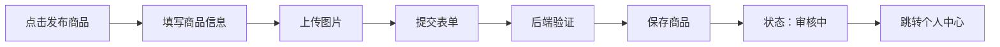
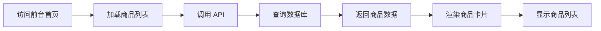

# EduSwap 项目架构说明

> 🏗️ 基于若依框架的教育交换平台 - 完整技术架构与模块设计

---

## 📋 项目概述

### 基本信息
- **项目名称**: EduSwap (教育交换平台)
- **技术栈**: Spring Boot + Vue + Element UI
- **框架版本**: 若依 RuoYi-Vue 3.9.1
- **开发语言**: Java 8 + JavaScript
- **数据库**: MySQL 5.7+
- **缓存**: Redis 5.0+

### 项目定位
基于若依框架二次开发的教育交换平台，实现校园闲置物品交易功能。

---

## 🏛️ 系统架构

### 整体架构图
```
┌─────────────────────────────────────────────────────────┐
│                     用户层                               │
│  ┌──────────┐  ┌──────────┐  ┌──────────              │
│  │ 学生用户 │  │ 管理员   │  │ 访客     │              │
│  └──────────┘  └──────────  └──────────┘              │
└─────────────────────────────────────────────────────────┘
                        ↓
┌─────────────────────────────────────────────────────────┐
│                     前端层 (Vue2)                        │
│  ┌────────────────────┐  ┌────────────────────┐        │
│  │  前台商城 (学生)   │  │  后台管理 (管理员) │        │
│  │  FrontLayout       │  │  Layout            │        │
│  └────────────────────┘  └────────────────────┘        │
└─────────────────────────────────────────────────────────┘
                        ↓
┌─────────────────────────────────────────────────────────┐
│                   网关层 (Nginx)                         │
│            负载均衡 + 反向代理 + 静态资源                 │
└─────────────────────────────────────────────────────────┘
                        ↓
┌─────────────────────────────────────────────────────────┐
│                 应用层 (Spring Boot)                     │
│  ┌─────────────────────────────────────────────────┐   │
│  │  Spring Security + JWT 认证授权                  │   │
│  └─────────────────────────────────────────────────┘   │
│  ┌─────────┐ ┌─────────┐ ┌─────────┐ ┌─────────┐     │
│  │ Admin   │ │ System  │ │ Quartz  │ │ Generator│    │
│  │ 模块    │ │ 模块    │ │ 模块    │ │ 模块     │    │
│  └─────────┘ └─────────┘ └─────────┘ └─────────┘     │
└─────────────────────────────────────────────────────────┘
                        ↓
┌─────────────────────────────────────────────────────────┐
│                   数据层                                 │
│  ┌──────────┐  ┌──────────  ┌──────────┐              │
│  │  MySQL   │  │  Redis   │  │  MyBatis │              │
│  └──────────┘  └──────────  └──────────┘              │
└─────────────────────────────────────────────────────────┘
```

---

## 📦 模块结构

### 后端模块

#### 1. eduswap-admin (后台管理模块)
**职责**: Web 应用入口，提供 RESTful API

**主要功能**:
- 启动类：`RuoYiApplication`
- Servlet 初始化：`RuoYiServletInitializer`
- 业务控制器：`biz/controller/`
- 系统控制器：`web/controller/`

**目录结构**:
```
eduswap-admin/
├── src/main/
│   ├── java/com/eduswap/
│   │   ├── biz/controller/      # 业务控制器
│   │   └── web/controller/      # 系统控制器
│   └── resources/
│       ├── mapper/biz/          # 业务 Mapper
│       └── application.yml      # 配置文件
└── pom.xml
```

#### 2. eduswap-framework (核心框架模块)
**职责**: 框架核心功能封装

**主要功能**:
- Spring Security 配置
- JWT Token 处理
- 拦截器配置
- 异常处理
- 权限验证

**关键类**:
- `SpringSecurityConfig` - 安全配置
- `JwtAuthenticationTokenFilter` - Token 过滤器
- `PermissionService` - 权限服务

#### 3. eduswap-system (系统管理模块)
**职责**: 系统管理功能

**主要功能**:
- 用户管理
- 角色管理
- 菜单管理
- 部门管理
- 岗位管理
- 字典管理
- 参数设置
- 日志管理

#### 4. eduswap-quartz (定时任务模块)
**职责**: 任务调度管理

**主要功能**:
- 任务配置
- 任务执行
- 任务日志
- Cron 表达式

#### 5. eduswap-generator (代码生成模块)
**职责**: 代码自动生成

**主要功能**:
- 数据库表导入
- 代码模板生成
- 页面 CRUD 生成
- 批量生成支持

**已生成页面** (8 个):
1. 商品管理
2. 订单管理
3. 分类管理
4. 收藏管理
5. 消息管理
6. 评价管理
7. 举报管理
8. 统计分析

#### 6. eduswap-common (通用工具模块)
**职责**: 通用工具类和常量定义

**主要功能**:
- 工具类：日期、字符串、加密等
- 常量定义
- 注解定义
- 异常处理
- 核心领域类

**关键包**:
```
eduswap-common/
├── annotation/        # 自定义注解
├── config/           # 配置类
├── constant/         # 常量类
├── core/             # 核心类
├── enums/            # 枚举类
├── exception/        # 异常类
├── filter/           # 过滤器
├── utils/            # 工具类
└── xss/              # XSS 防护
```

### 前端模块

#### eduswap-ui (前端页面模块)

**目录结构**:
```
eduswap-ui/
├── src/
│   ├── api/              # API 接口
│   ├── assets/           # 静态资源
│   ├── components/       # 组件
│   ├── directive/        # 指令
│   ├── layout/           # 布局
│   │   ├── components/   # 布局组件
│   │   └── front/        # 前台布局
│   ├── plugins/          # 插件
│   ├── router/           # 路由
│   ├── store/            # 状态管理
│   ├── utils/            # 工具
│   ├── views/            # 页面
│   │   ├── front/        # 前台页面
│   │   ├── system/       # 系统页面
│   │   └── biz/          # 业务页面
│   ├── App.vue          # 根组件
│   ├── main.js          # 入口文件
│   └── permission.js    # 权限控制
├── public/              # 公共资源
└── package.json         # 依赖配置
```

**核心页面**:

**前台页面** (`views/front/`):
1. `Home.vue` - 前台购物首页
2. `ProductDetail.vue` - 商品详情页
3. `Publish.vue` - 发布商品页
4. `UserCenter.vue` - 个人中心

**后台页面**:
- `index.vue` - 后台管理首页
- `system/` - 系统管理页面
- `biz/` - 业务管理页面

---

## 🗄️ 数据库设计

### 核心表结构

#### 1. 系统表 (sys_*)
- `sys_user` - 用户表
- `sys_role` - 角色表
- `sys_menu` - 菜单表
- `sys_dept` - 部门表
- `sys_post` - 岗位表
- `sys_dict_type` - 字典类型
- `sys_dict_data` - 字典数据
- `sys_config` - 参数配置
- `sys_oper_log` - 操作日志
- `sys_logininfor` - 登录日志

#### 2. 业务表 (biz_*)
- `biz_product` - 商品表
- `biz_order` - 订单表
- `biz_category` - 分类表
- `biz_favorite` - 收藏表
- `biz_message` - 消息表
- `biz_comment` - 评价表
- `biz_report` - 举报表
- `biz_statistics` - 统计表

#### 3. 定时任务表 (qrtz_*)
- 12 张 Quartz 任务调度表

---

## 🔐 权限控制

### RBAC 模型
```
用户 (User) → 角色 (Role) → 菜单/权限 (Menu/Permission)
```

### 权限流程
```
1. 用户登录
   ↓
2. 验证用户名密码
   ↓
3. 生成 JWT Token
   ↓
4. 获取用户角色和权限
   ↓
5. 动态加载路由菜单
   ↓
6. 根据权限显示功能
```

### 角色分类
- **admin** - 管理员角色（访问后台）
- **customer** - 顾客角色（访问前台）
- **common** - 普通用户角色

### 路由权限
- **前台路由**: `/index`, `/product/:id`, `/publish`, `/user/center`
- **后台路由**: `/dashboard`, `/system/*`, `/biz/*`

---

## 🎨 前端架构

### 布局组件

#### 1. FrontLayout (前台布局)
**用途**: 前台购物页面使用

**结构**:
```
┌─────────────────────────────┐
│      顶部导航栏 (Logo、搜索)  │
├─────────────────────────────┤
│                             │
│         内容区域             │
│                             │
└─────────────────────────────┘
```

**特点**:
- 无侧边栏
- 顶部导航
- 简洁明了
- 用户友好

#### 2. Layout (后台布局)
**用途**: 后台管理页面使用

**结构**:
```
┌──────┬──────────────────────┐
│      │  顶部导航 + 标签页     │
│ 侧   ├──────────────────────┤
│ 边   │                      │
│ 栏   │     内容区域          │
│      │                      │
└──────┴──────────────────────┘
```

**特点**:
- 左侧菜单
- 标签页导航
- 功能丰富
- 权限控制

### 组件化设计

#### 核心组件
- `Sidebar` - 侧边栏菜单
- `TagsView` - 标签页视图
- `Navbar` - 顶部导航栏
- `AppMain` - 主内容区

#### 业务组件
- 商品列表组件
- 商品卡片组件
- 分类导航组件
- 图片上传组件
- 富文本编辑器

---

## 🔄 核心流程

### 1. 用户登录流程


### 2. 商品发布流程


### 3. 商品展示流程


---

## 📊 数据流

### 前端数据流
```
Vue Component
    ↓
Vuex Store
    ↓
API Service
    ↓
Axios Interceptor
    ↓
Backend API
```

### 后端数据流
```
Controller
    ↓
Service
    ↓
Mapper
    ↓
Database
```

---

## 🛠️ 技术栈详解

### 后端技术栈
| 技术 | 版本 | 用途 |
|------|------|------|
| Spring Boot | 2.5.15 | 核心框架 |
| Spring Security | 5.7.14 | 安全认证 |
| MyBatis | - | ORM 框架 |
| Druid | 1.2.27 | 数据库连接池 |
| PageHelper | 1.4.7 | 分页插件 |
| Fastjson2 | 2.0.60 | JSON 解析 |
| JWT | 0.9.1 | Token 认证 |
| Quartz | - | 定时任务 |
| Swagger | 3.0.0 | API 文档 |

### 前端技术栈
| 技术 | 版本 | 用途 |
|------|------|------|
| Vue | 2.x | 核心框架 |
| Vue Router | 3.x | 路由管理 |
| Vuex | 3.x | 状态管理 |
| Element UI | 2.x | UI 组件库 |
| Axios | 0.x | HTTP 请求 |
| Sass | - | CSS 预处理器 |
| Babel | - | JS 转译器 |

---

## 📈 性能优化

### 后端优化
1. **数据库连接池**: Druid 高性能连接池
2. **缓存**: Redis 缓存热点数据
3. **分页**: PageHelper 分页查询
4. **索引**: 数据库索引优化
5. **连接**: 数据库连接池配置优化

### 前端优化
1. **路由懒加载**: 按需加载页面
2. **组件化**: 组件复用
3. **打包优化**: Webpack 压缩
4. **CDN**: 静态资源 CDN
5. **缓存**: 浏览器缓存策略

---

## 🔒 安全机制

### 认证机制
- JWT Token 认证
- Token 自动刷新
- 登录超时处理

### 授权机制
- RBAC 权限模型
- 菜单权限控制
- 按钮权限控制
- 数据权限控制

### 安全防護
- XSS 攻击防护
- SQL 注入防护
- CSRF 防护
- 密码加密存储

---

## 📝 开发规范

### 代码规范
- **Java**: 阿里巴巴 Java 开发手册
- **Vue**: Vue 官方风格指南
- **命名**: 驼峰命名法
- **注释**: Javadoc 规范

### Git 规范
```bash
# 提交类型
feat: 新功能
fix: 修复 bug
docs: 文档更新
style: 代码格式
refactor: 重构
test: 测试
chore: 构建/工具

# 示例
git commit -m "feat: 添加商品搜索功能"
```

### 分支规范
```
main         # 主分支
dev          # 开发分支
feature/*    # 功能分支
fix/*        # 修复分支
```

---

## 🚀 部署架构

### 开发环境
```
localhost:8080  # 后端服务
localhost:1024  # 前端服务
```

### 生产环境
```
Nginx (反向代理)
    ↓
┌──────────────┐
│  应用服务器   │
│  (Spring Boot)│
└──────────────┘
    ↓
┌──────────────┐
│   MySQL      │
│   Redis      │
└──────────────┘
```

---

## 📞 技术支持

### 开发工具
- **IDE**: IntelliJ IDEA / VS Code
- **数据库**: MySQL Workbench / Navicat
- **API 测试**: Postman / Swagger
- **版本控制**: Git

### 文档资源
- [若依框架文档](http://www.ruoyi.vip/)
- [Vue 官方文档](https://cn.vuejs.org/)
- [Spring Boot 文档](https://spring.io/projects/spring-boot)
- [Element UI 文档](https://element.eleme.cn/)

---

*最后更新：2026-03-13*
